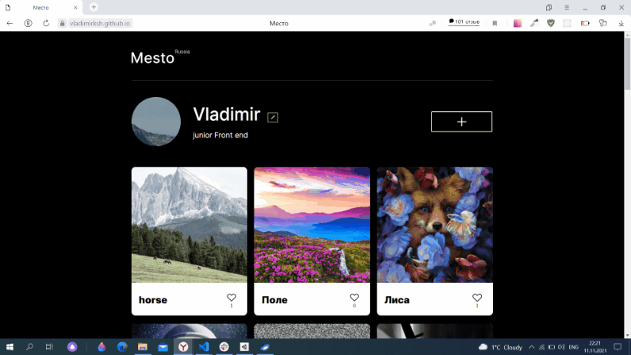

# Проект: Место




### Реализованная функциональность прокта: ###

:white_check_mark: Добавления и удаления фотографий    
:white_check_mark: Ставить лайки    
:white_check_mark: Редактирование текстовой информацию о себе (имя, род деятельности)    
:white_check_mark: Возможность редактировать аватар пользователя    
:white_check_mark: Колличество поставленных лайков    
:white_check_mark: Подключить проект к серверу    

### Предстоит доделать: ###
:black_square_button: Переписать проект на React

____
В проекте используется **HTML, CSS и JavaScript**. Сайт адаптирован под экраны от 320px и больше.
При вёрстке использован подход Desktop First.

Реализована валидация форм: при вводе некорректных данных отправка формы блокируется, под полями ввода появляются ошибки. А ещё добавлена возможность закрыть модальное окно кликом на оверлей и по нажатию клавиши Esc.

Весь JavaScript-код разбит на классы. Проект собран при помощи Webpack, Babel, настроена обработка CSS, HTML, изображений и шрифтов.

___
## Стек
+ HTML
+ CSS
+ JavaScript


## Реализация
+ Grid Layout
+ Flexbox-вёрстка
+ Медиазапросы
+ Использование относительных величин при указании размеров блоков и элементов
+ Использование JavaScript: для создания интерактивных элементов страницы внесения изменений в DOM и валидации форм
+ ООП
+ Webpack

[Ссылка на работу](https://vladimirksh.github.io/mesto/)
___

## Запуск проекта ##

1. Клонировать репозиторий

    ```git clone https://github.com/vladimirksh/mesto.git```

2. Установить зависимости

    ```npm install```

3. Для запуска используйте команды:

    ```npm run dev```
  Запуск проекта в режиме разработки. Для просмотра результатов в браузере откройте http://localhost:8080 После внесения изменений страница перезагрузится автоматически.

    ```npm run build```
  Создает финальную сборку проекта, готовую для развертывания, в папке dist